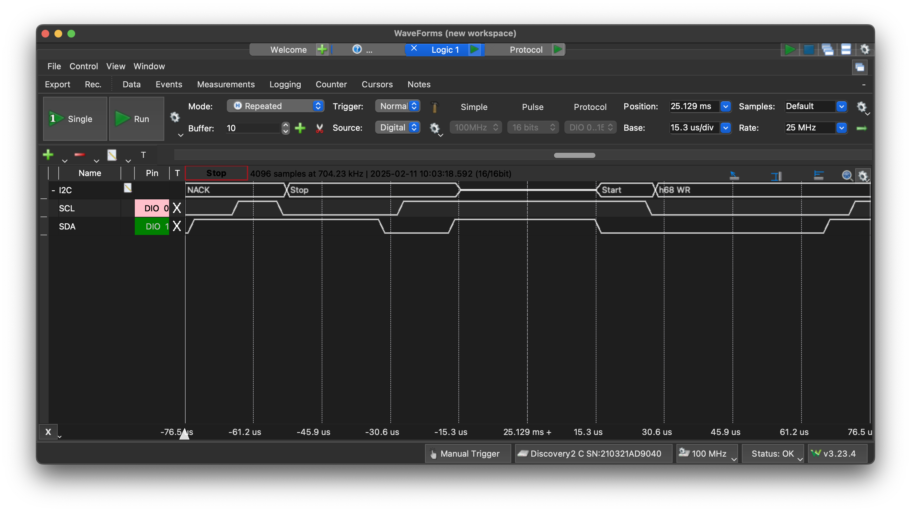
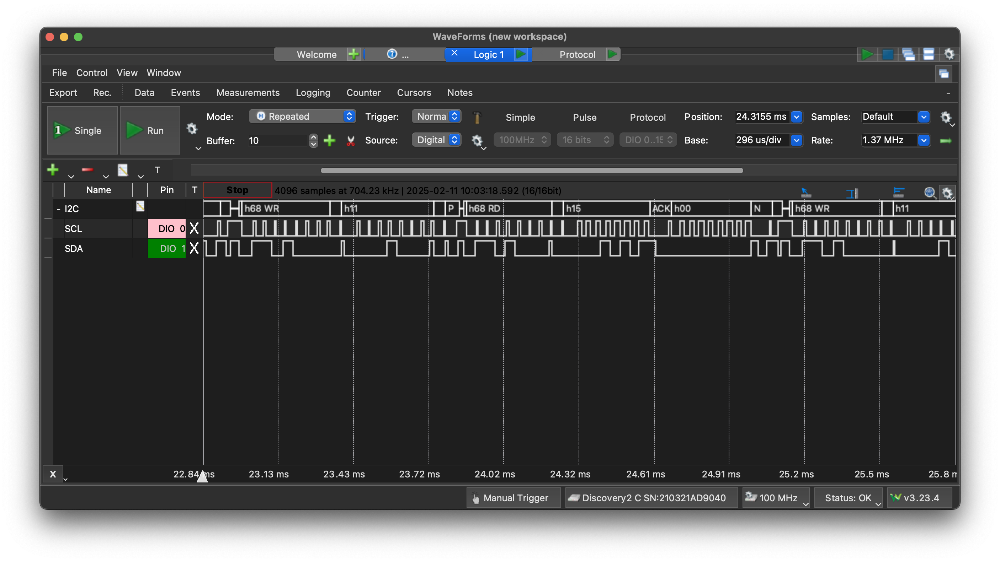
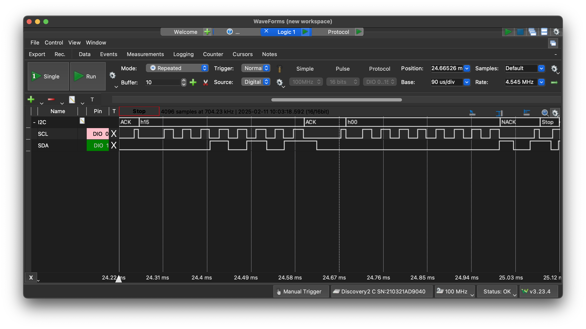

[](https://classroom.github.com/a/ajoH7Ne3)
# EELE 465 Project 2

In this project, we bit-banged i2c and communicated with a real-time clock using functions to read and write bytes from a DS3231 RTC.

Bit-banging required us to write all needed functions from scratch. This project is meant to help familiarize us with low-level MCU programming.

## Flowchart
Below is the flowchart containing all functions used in this project.


## RTC
Reading from the RTC utilizes the `i2c_read` function, which calls the following functions internally (some functions are used more than once):
```
i2c_start
i2c_tx_byte
i2c_stop
i2c_rx_byte
i2c_tx_ack
i2c_tx_nack
```
On `i2c_start`, `i2c_read` will send the address byte of the slave device with a write bit (0). The program will receive three bytes of data from the slave's seconds, minutes, and hours registers. These values will be saved to the appropriate variables when received. The program will send a nack when the final byte is received.

### Start Stop Bit


### Address W/R Bit


### Transmission
Full transmission


2-3 Bytes of Data


## Temperature Reading
This calls `i2c_read_temperature`, which fundamentally does the same thing as `i2c_read`, but will read from the temperature registers instead. The temperature values, encoded in 2's complement HEX, are saved in variables as well. This can be converted to decimal, then from Celsius to Fahenheit using Google.

Room temperature is about 20-22°C (68-72°F).